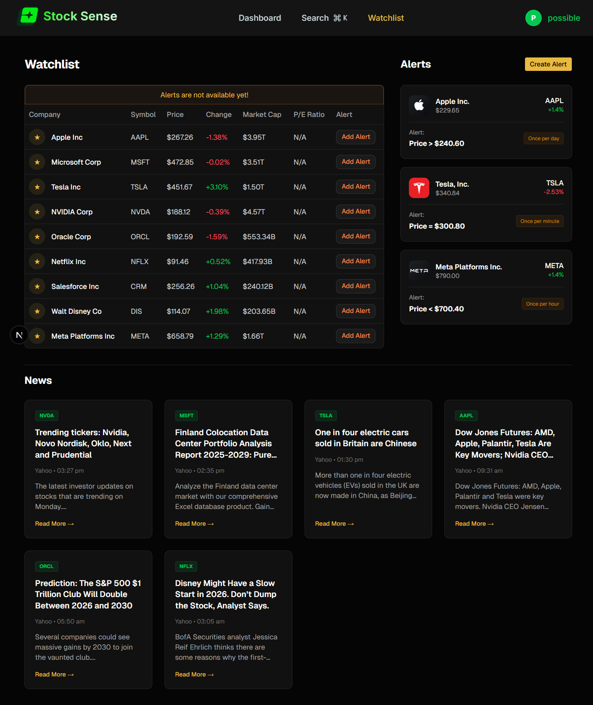
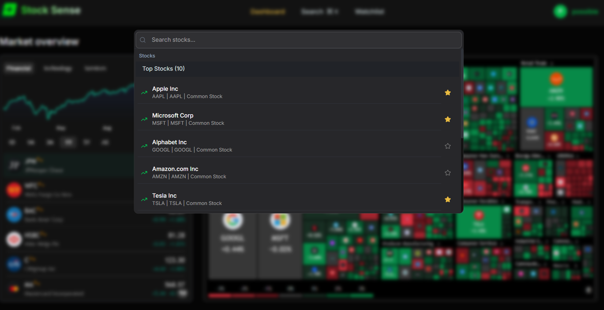

# Stock Sense

A modern, full-stack stock market tracking application built with Next.js 15. Keep track of your favorite stocks, get real-time updates, and stay informed with daily news summaries.


## 🚀 Tech Stack

- **Framework:** [Next.js 15](https://nextjs.org/) (App Router)
- **Language:** TypeScript
- **Styling:** [Tailwind CSS v4](https://tailwindcss.com/)
- **UI Components:** [Shadcn UI](https://ui.shadcn.com/), [Radix UI](https://www.radix-ui.com/), [Base UI](https://base-ui.com/)
- **Database:** MongoDB (via Mongoose)
- **Authentication:** [Better Auth](https://www.better-auth.com/)
- **Background Jobs:** [Inngest](https://www.inngest.com/)
- **Forms:** React Hook Form
- **Icons:** Lucide React
- **Email:** NodeMailer
- **Stock Data:** Finnhub API

> **Note:**  Finnhub API is free tier, so it may be limited in terms of the number of requests per minute. also it may not be available in all countries.

> **Inngest:** Inngest background jobs are used to send daily news summaries to users via email. I might stoped background job service
for now to save api costs.

## ✨ Features

- **Real-time Stock Search:** Instantly search for stocks using a command interface.
- **Watchlist:** personalized watchlist to track your favorite stocks.
- **Authentication:** Secure user sign-up and login functionality.
- **Daily News Summaries:** Automated daily news digests sent via email (powered by Inngest).
- **Responsive Design:** Beautiful, responsive UI designed with Tailwind CSS.

## 🛠️ Getting Started

Follow these steps to customize and run the project locally:

1.  **Clone the repository:**

    ```bash
    git clone https://github.com/P0SSIBLE-0/stock-sense.git
    cd stock-sense
    ```

2.  **Install dependencies:**

    ```bash
    npm install
    # or
    yarn install
    # or
    pnpm install
    ```

3.  **Set up Environment Variables:**

    Create a `.env` file in the root directory and add the necessary environment variables (e.g., MongoDB URI, Authentication secrets, API keys).

    ```bash
    NODE_ENV=development
    NEXT_PUBLIC_BASE_URL=http://localhost:3000
    MONGODB_URI=mongodb://localhost:27017/stock-sense

    #BETTER_AUTH
    BETTER_AUTH_SECRET=your-secret
    BETTER_AUTH_URL=http://localhost:3000

    GEMINI_API_KEY=your-api-key
    
    #NODEMAILER
    NODEMAILER_EMAIL=your-email
    NODEMAILER_PASSWORD=your-password
    NEXT_PUBLIC_FINNHUB_API_KEY=your-api-key
    ```

4.  **Run the development server:**

    ```bash
    npm run dev
    ```

    Open [http://localhost:3000](http://localhost:3000) with your browser to see the result.

## 📸 More Previews

### Watchlist


### Search



